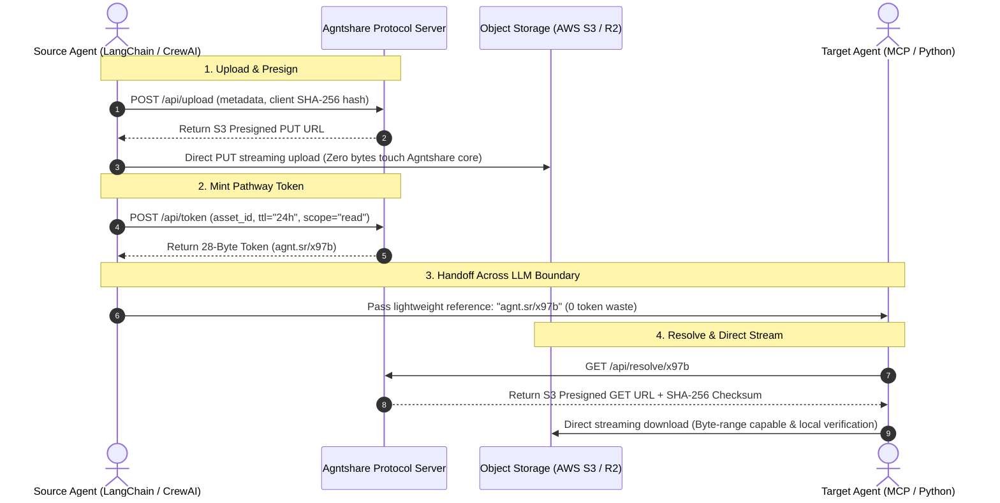

# Agntshare

[](https://github.com/Deepak-githubuser24/agntshare/actions)
[](LICENSE)
[](https://pypi.org/project/agntshare/)
[](packages/mcp-server)

> **HTTPS for AI Agent State. Pass a cryptographically secure 28-byte token between agents instead of stuffing 50MB raw JSON payloads into prompt windows.**

---

## ⚡ The Problem vs. Agntshare

When multi-agent workflows scale, passing working memory, complex execution state, or large files across LLM network boundaries creates an severe architectural bottleneck. Stuffing multi-megabyte JSON payloads into prompt windows bleeds compute costs, incurs multi-second network latency, and causes severe context degradation.

Agntshare replaces raw context stuffing with a lightweight, cryptographically verified **"coat-check ticket"** for the agentic web.

| Metric | Raw Prompt Handoff (DIY / LLM Context) | Agntshare Protocol | Why Agntshare Wins |
| :--- | :--- | :--- | :--- |
| **Latency / Hop** | `15s` (Inference string serialization & HTTP lag) | `200ms` (Direct edge resolution & presigned streams) | **75x+ faster** handoffs without inference bottlenecking |
| **Payload Capacity** | `128k tokens` (~500KB before context degradation) | `500MB+` (Via a 28-byte scoped pathway token) | Pass enterprise datasets, PDFs, or memory without context limits |
| **Handoff Cost** | `$1.20` per hop (Repetitive token consumption across agents) | `$0.001` (Zero inference token waste during transport) | **1,000x+ cheaper**, eliminating redundant LLM input/output fees |

---

## 🚀 5-Minute Quick Start

### Install via PyPI or npm

```bash
pip install agntshare
# Or for Node.js / TypeScript: npm install @agentshare/sdk
```

### Python Quickstart: Upload, Mint, and Resolve

```python
import agntshare

# 1. Initialize client with your API key & agent identity
client = agntshare.Client(
    api_key="your_api_key_here",
    agent_id="research_swarm_01"
)

# 2. Upload raw agent execution memory or artifact payload
asset = client.upload(
    payload={"agent_memory": "Complete deep-research diagnostic results...", "metrics": [98.4, 99.1]},
    metadata={"source_framework": "langchain", "session_id": "sess_8941"}
)

# 3. Mint a cryptographically secure 28-byte pathway token
token = client.mint(
    asset_id=asset.id,
    scope="read",
    ttl="24h"
)
print(f"Generated Pathway Token: {token.uri}")  # e.g., agnt.sr/x97b

# 4. Target Agent resolves the token to instantly stream state
resolved_state = client.resolve(
    token="agnt.sr/x97b",
    keys=["agent_memory"]  # Selective retrieval cuts bandwidth overhead
)
print("Resolved Payload:", resolved_state["agent_memory"])
```

---

## 🏗️ The Blind Pipe Architecture

Agntshare decouples agent state from the LLM context window. Our server functions strictly as a **stateless, opaque pipe**—orchestrating secure presigned URLs directly between your autonomous agents and your object storage layer.



### ASCII Transport Flow
```text
 +-----------------+        (1. Upload via Presigned URL)        +-----------------+
 |  Source Agent   | ==========================================> |  Object Storage |
 | (128k+ Context) |                                             |  (S3 / R2 / Blob)|
 +-----------------+                                             +-----------------+
          |                                                               |
          | (2. Mint 28-Byte Token: agnt.sr/x97b)                         |
          v                                                               |
 +-----------------+                                                      |
 | Agntshare Core  |   <-- Server stays an opaque, stateless pipe         |
 +-----------------+                                                      |
          |                                                               |
          | (3. Pass lightweight Token)                                   |
          v                                                               |
 +-----------------+        (4. Resolve & Direct Stream)                  |
 |  Target Agent   | <================================================----+
 | (Instant Read)  |        (Verified by Local SHA-256 Checksum)
 +-----------------+
```

---

## 🛡️ Zero-Trust Security & Enterprise Governance

Agntshare is engineered from first principles for high-security production deployments:

* **🔒 Local-First Hashing:** All payloads are SHA-256 checksummed client-side by our open-source SDKs *before* leaving your infrastructure. When a target agent resolves a token, data integrity is mathematically verified locally—preventing silent bit-rot or man-in-the-middle tampering without server trust.
* **👁️‍🗨️ Zero Raw Bytes Read by the Protocol:** The Agntshare backend operates as a dumb, opaque routing authority. By orchestrating secure presigned S3 URLs, **our servers never touch, inspect, read, or buffer your file payload bytes**, ensuring total confidentiality and a minimal compliance footprint.
* **📦 Storage Stays in Your Bucket:** Complete sovereignty over physical storage boundaries. Bring your own AWS S3, Cloudflare R2, MinIO, or Vercel Blob storage buckets. Your enterprise retains sovereign control over data residency, IAM policies, encryption-at-rest keys, and retention lifecycles.
* **📜 Immutable Audit Trails & Revocation:** Every file upload, token mint, and resolution request is logged to a structured PostgreSQL audit trail (`agent_id`, `session_id`, `agent_role`). Tokens enforce programmatic hard TTL expiration and instant revocation via `client.revoke_token(...)`.

---

## 🔌 Ecosystem & MCP Integration

Agntshare runs out of the box as a native **Model Context Protocol (MCP)** server, making it instantly compatible with Claude Desktop, Cursor, and any MCP-enabled IDE or framework without writing custom code.

| Package | Purpose | Path |
| :--- | :--- | :--- |
| **`agntshare` (PyPI)** | Python client library for high-speed agent handoffs | [`agentshare-python`](agentshare-python) |
| **`@agentshare/sdk`** | TypeScript / Node.js client SDK | [`packages/sdk-ts`](packages/sdk-ts) |
| **`@agentshare/mcp-server`** | Native MCP server for Claude & Cursor integration | [`packages/mcp-server`](packages/mcp-server) |
| **`agentshare-langchain`** | Native LangChain & LangGraph sidecar integration | [`packages/agentshare-langchain`](packages/agentshare-langchain) |

---

## 🤝 Contributing

We welcome contributions, bug reports, and structural RFC proposals from engineering teams building production AI agents!

1. **Fork the repository** and create your feature branch: `git checkout -b feature/amazing-feature`.
2. **Commit your changes**: `git commit -m "feat: implement amazing feature"`.
3. **Push to your branch**: `git push origin feature/amazing-feature`.
4. **Open a Pull Request** for engineering team review.

For bug reports and architectural discussions, please open an issue directly on GitHub: [https://github.com/Deepak-githubuser24/agntshare/issues](https://github.com/Deepak-githubuser24/agntshare/issues).
For closed beta feedback or direct support, reach out to: `techbit.ai.bytes@gmail.com`.

---

## 📄 License

Distributed under the MIT License. See [`LICENSE`](LICENSE) for more information.

© 2026 Agntshare Protocol Standards & Contributors
